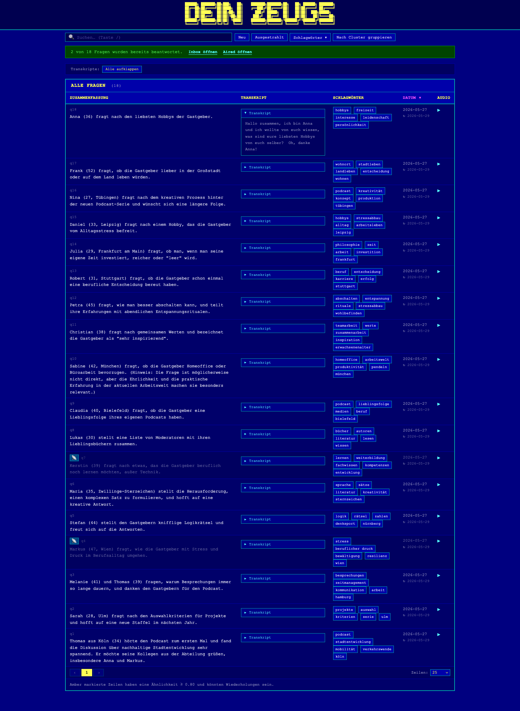

# dein-zeugs — Podcast-Fragenverwaltung

Ein macOS-Werkzeug für Apple Silicon, das aufgezeichnete Hörerfragen transkribiert, nach Neuheit bewertet, Duplikate gruppiert und einen HTML-Bericht erstellt.

**Voraussetzungen:** macOS 14+, Apple Silicon (arm64).



---

## Installation

1. Das Release-Archiv von der [Releases-Seite](../../releases/latest) herunterladen (~70 MB) und entpacken. Es enthält zwei Dateien:
   - `dein-zeugs` — das Programm
   - `dein-zeugs.command` — der Starter (diesen doppelklicken)
2. Beide Dateien zusammen an einen dauerhaften Ort verschieben (z. B. in den Ordner `Programme` im Finder).
3. `dein-zeugs.command` doppelklicken → macOS fragt einmalig, ob die Datei geöffnet werden soll → **Öffnen** klicken.

Beim ersten Start werden automatisch alle benötigten Modelle heruntergeladen (~2,3 GB). Danach ist keine Internetverbindung mehr nötig.

---

## Tägliche Nutzung

1. MP3-Aufnahmen der Hörerfragen in `~/DeinZeugs/inbox/` ablegen.
2. **dein-zeugs.command** doppelklicken.
3. Der Bericht öffnet sich automatisch im Browser.

**Ausgestrahlte Fragen:** Sobald eine Frage gesendet wurde, die MP3 aus `inbox/` in `~/DeinZeugs/aired/` verschieben. Beim nächsten Start dient `aired/` als Referenzkorpus — neue Fragen werden auf Neuheit gegenüber allem in `aired/` bewertet. Der Bericht enthält `file://`-Links zu beiden Ordnern, sodass das Verschieben direkt im Finder erfolgen kann.

---

## Kommandozeilennutzung

Ohne Unterbefehl läuft der vollständige Durchlauf (transkribieren → analysieren → gruppieren → Bericht öffnen):

```
dein-zeugs [verzeichnis]
```

Einzelne Schritte können auch separat ausgeführt werden:

```
dein-zeugs initialize        # Ordnerstruktur und config.toml anlegen
dein-zeugs fetch-models      # Modelle herunterladen (~2,3 GB)
dein-zeugs fetch-models --skip-llm   # nur Whisper + Einbettungsmodell
dein-zeugs transcribe        # Audiodateien transkribieren
dein-zeugs analyze           # Transkripte analysieren
dein-zeugs cluster           # Gruppierung neu berechnen und Bericht öffnen
dein-zeugs report            # Bericht aus vorhandenen Daten erstellen
dein-zeugs delete-outputs    # analysis/ und reports/ leeren (inbox/ bleibt erhalten)
dein-zeugs delete-downloads  # heruntergeladene Modelldateien löschen
```

Alle Unterbefehle akzeptieren ein optionales Verzeichnis als erstes Argument (Standard: `~/DeinZeugs`). `delete-outputs` und `delete-downloads` kennen außerdem `--yes`/`-y`, um Rückfragen zu überspringen. `fetch-models` und `transcribe`/`analyze` kennen `--force`, um bereits verarbeitete Dateien erneut zu verarbeiten.

---

## Konfiguration

Eine `config.toml` wird beim ersten Start automatisch im Stammverzeichnis angelegt:

```toml
[analysis]
similarity_threshold = 0.80          # Kosinus-Ähnlichkeit, ab der eine Frage als Wiederholung gilt
whisper_model = "medium"             # tiny / base / small / medium / large
embedding_model = "sentence-transformers/paraphrase-multilingual-MiniLM-L12-v2"
llm_model_path = "~/.dein_zeugs/models/Llama-3.2-3B-Instruct-Q4_K_M.gguf"

[paths]
analysis_dir = "analysis"            # optionale Überschreibung
reports_dir  = "reports"             # optionale Überschreibung

[report]
standouts_count = 10                 # Anzahl der Fragen im Highlights-Abschnitt
```

---

## Verzeichnisstruktur

```
~/DeinZeugs/
  inbox/                    # MP3-Aufnahmen hier ablegen
  aired/                    # MP3s hierher verschieben, sobald die Frage ausgestrahlt wurde
  analysis/{stem}.yaml      # eine YAML-Datei pro Frage (Transkript, Analyse, Einbettung, Scores)
  reports/report.html       # der gerenderte Bericht (öffnet sich nach jedem Start automatisch)
  config.toml               # wird automatisch mit Standardwerten angelegt
```

Modelldateien liegen außerhalb des Projektstammordners:

```
~/.cache/huggingface/hub/   # Whisper- und Einbettungsmodell-Cache (~200 MB)
~/.cache/fastembed/         # fastembed-Cache
~/.dein_zeugs/models/       # LLM GGUF (~2 GB)
```

---

## Was der Bericht zeigt

Der Bericht zeigt alle Fragen in einer sortierbaren, durchsuchbaren Tabelle. Ausgestrahlte Fragen erscheinen gedimmt. Ein Neuheitswert (0–1) gibt an, wie einzigartig eine Frage ist — grün ≥ 0,7, gelb 0,4–0,7, rot < 0,4. Fragen lassen sich nach Cluster gruppieren; ähnliche Fragen werden dabei zusammengefasst.

---

## Optional: Automator-Ordneraktion

Wer dein-zeugs automatisch starten möchte, sobald eine Datei in `inbox/` abgelegt wird, kann eine macOS-Automator-Ordneraktion einrichten. Die Schritt-für-Schritt-Anleitung steht unter [`installer/com.dein_zeugs.folderaction.workflow.md`](installer/com.dein_zeugs.folderaction.workflow.md). Die meisten Nutzer können diesen Abschnitt ignorieren.

---

## Aus dem Quellcode bauen (nur für Maintainer)

Python 3.12 ist erforderlich; 3.14+ wird nicht unterstützt.

```bash
uv venv --python 3.12
source .venv/bin/activate
uv pip install -e ".[dev]"
uv pip install pyinstaller
make build            # erstellt dist/dein-zeugs (~70 MB)
make release          # signiert das Binary und packt dist/dein-zeugs-release.zip
```

Das fertige Archiv (`dist/dein-zeugs-release.zip`) als GitHub-Release hochladen.

---

## Entwicklung

```bash
uv venv --python 3.12
source .venv/bin/activate
uv pip install -e ".[dev]"
.venv/bin/pytest tests/ -q
```
